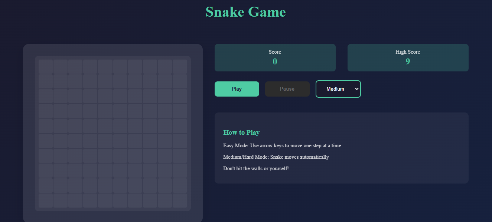
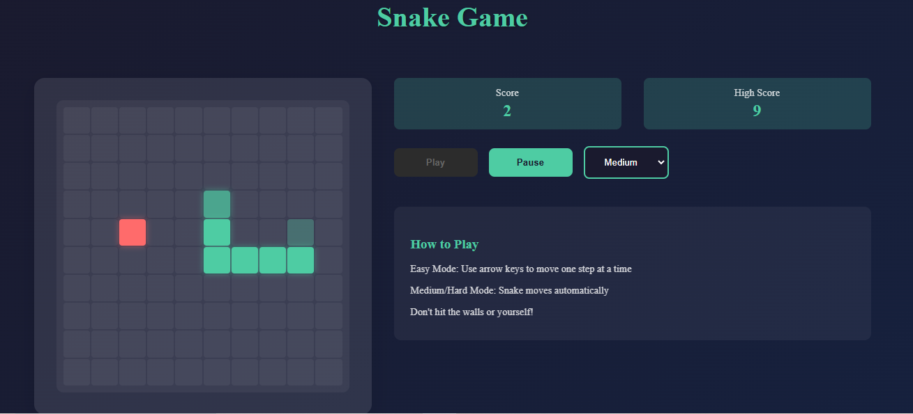
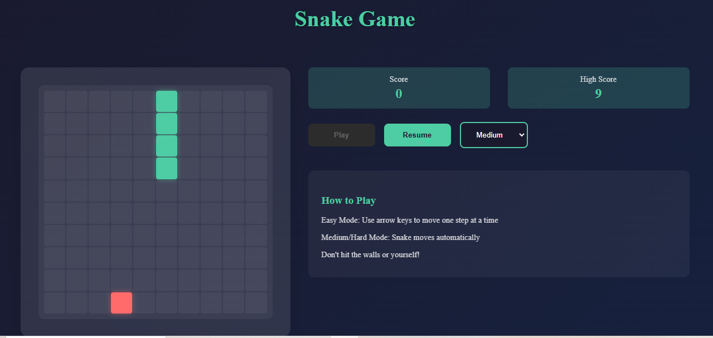
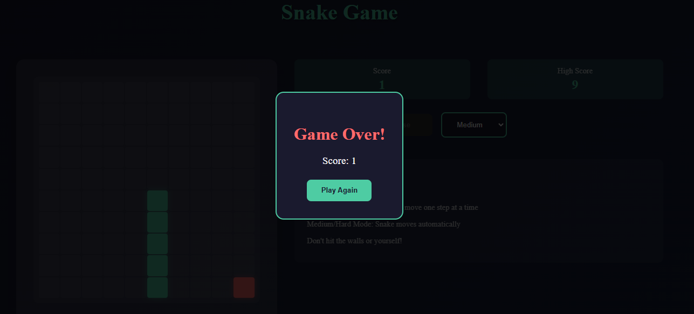

# 🐍 Snake Game

A classic and interactive implementation of the beloved Snake Game, offering multiple difficulty levels and engaging gameplay.

## 🎮 About the Project

Dive into the world of the classic Snake Game, where your objective is simple yet challenging: control a snake, eat food, grow longer, and avoid collisions. Test your skills across different difficulty levels and aim for the highest score!

### 🛠 Built With

- 
- 
- 

## ✨ Features

- 🎚 **Adaptive Difficulty Levels**
  - Easy, Medium, and Hard modes with varying gameplay speeds
  - Automatic and manual movement options

- 🏆 **Score Tracking**
  - Real-time high score tracking
  - Persistent score saving using `localStorage`

- ⏸ **Game Control**
  - Seamless pause and resume functionality
  - Intuitive arrow key controls

## 📸 Game Snapshots

### Game Start


### Gameplay


### Paused


### Game Over


## 🚀 Getting Started

### Prerequisites

- 🌐 Modern web browser (Chrome, Firefox, Edge, Safari)
- 💻 Git (for cloning the repository)

### Installation

1. Clone the repository:
   ```bash
   git clone https://github.com/canosa92/snake-game.git
   ```
2. Navigate to the project directory:
   ```bash 
   cd snake-game
   ```
3. Open *index.html* in your browser and start playing!

## 🎯 Gameplay Instructions

### **Objective**
Control the snake to eat food, grow in length, and achieve the highest score without colliding with walls or the snake's body.

---

### **Controls**

- **Arrow Keys**: Change the snake's direction.

**Modes**:
- 🟢 **Easy Mode**: Manual movement. Move the snake only when pressing arrow keys.
- 🟠 **Medium/Hard Mode**: Automatic movement. The snake moves continuously, requiring quick decisions.

---

### **Difficulty Levels**

- 🟢 **Easy**: Slow speed, fully manual control for relaxed gameplay.
- 🟠 **Medium**: Moderate speed with semi-automatic movement for more challenge.
- 🔴 **Hard**: Fast speed, requiring precise and strategic navigation for experienced players.

---

## 🤝 Contribute

Contributions are welcome! Here's how you can help:

1. Fork the repository.
2. Create a new branch:
   ```bash
   git checkout -b feature/your-feature
   ```
3. Commit your changes:
   ```bash 
   git commit -m "Add awesome feature"
   ```
4. Push to the branch:
   ```bash 
   git push origin feature/your-feature
   ```
5. Open a Pull Request.

## 📄 License

This project is licensed under the MIT License.

## 🌟 Acknowledgments

Inspired by the classic **Snake Game**.
Thanks to the open-source community for their continuous support and inspiration.

**Happy Gaming!** 🎮🐍


